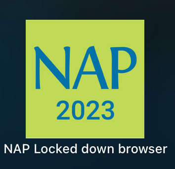

# Microsoft Edge Dev Bypass (macOS)
Access the internet and New Bing with Microsoft Edge Developer Build.
> **Warning**
>
> Please do not use this to cheat or violate academic integrity. This is a proof of concept to show how useless NAPLAN lockdown browser is.

## Requirements
### macOS
- macOS 10.15.4 Catalina or later (Only Ventura is tested!)
- Admin user account
- Internet access
- [Microsoft Edge Dev 110 or later](https://www.microsoftedgeinsider.com/en-us/download)
- [NAPLAN Locked Down Browser 2023](https://pages.assessform.edu.au/uploads/files/Release/NAP%20Locked%20down%20browser%20-%20Release%20-%205.3.0.pkg)

### Windows
- Not Supported

## Guide

### Step 1
Open NAPLAN Locked Down Browser 2023, **This will likely close your current browser, so read all of the instructions before attempting**.

### Step 2
Check that you can use this bypass **before entering a test**.

To check, press *Command+Q* on the menu screen to open an admin password prompt. Next, press *Command+Space* or *🔎*/*F6* on your keyboard. This should open spotlight search. From here, type *Microsoft Edge Dev* and press enter. 

Microsoft Edge Dev should open on a new desktop. Close Microsoft Edge Dev and swipe across the trackpad with 4 fingers or press *Command+tab* to switch back to the NAPLAN Locked Down Browser 2023.

You can now use this bypass in a test.

### [Return Home](../../README.md)