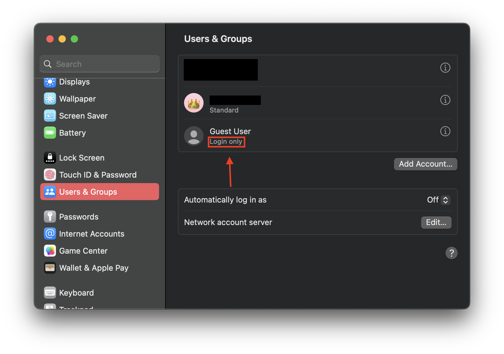
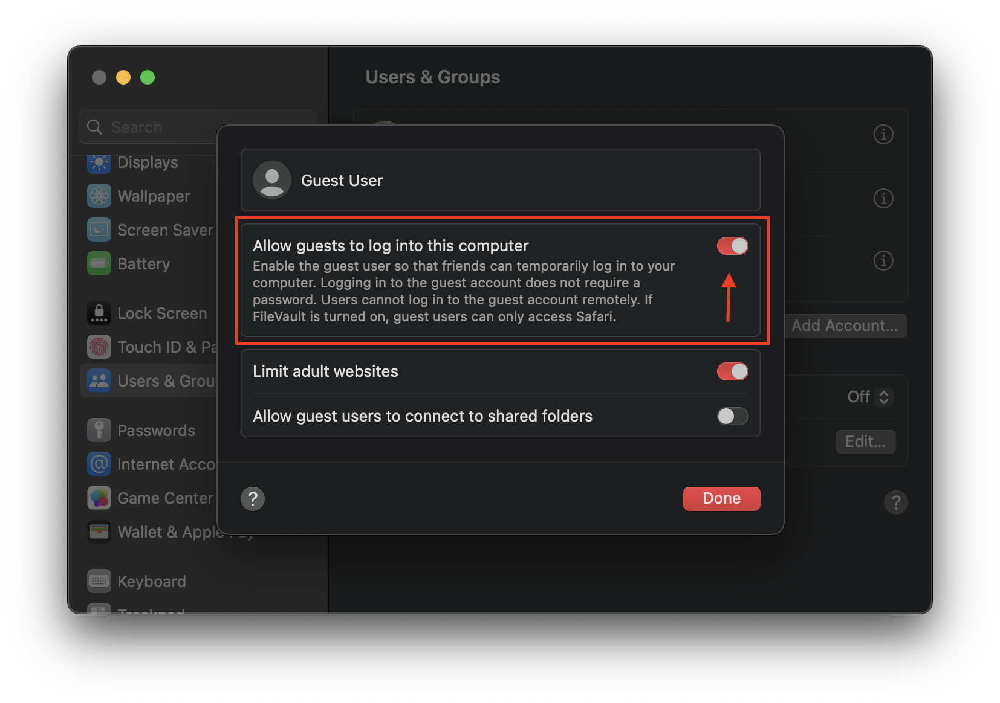
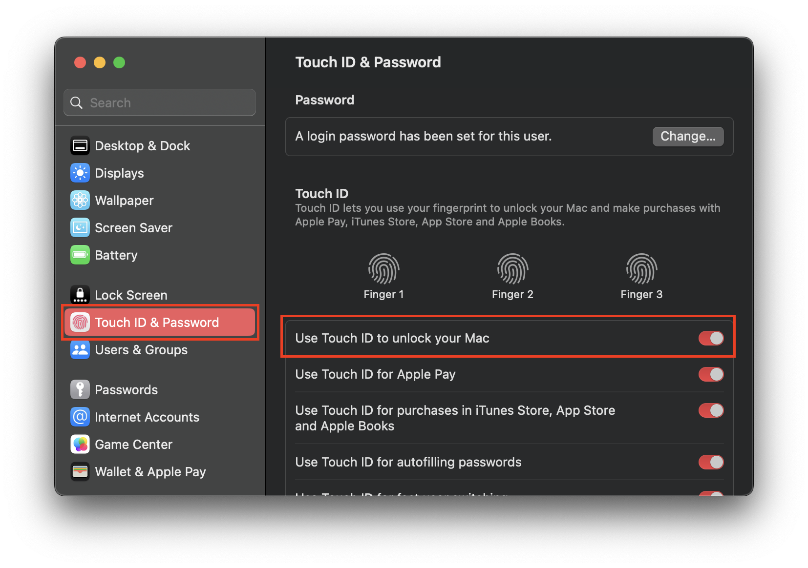

# Guest User Bypass (macOS)
Use a guest user for access to all apps on your computer
> **Warning**
>
> Please do not use this to cheat or violate academic integrity. This is a proof of concept to show how useless NAPLAN lockdown browser is.

## Requirements
### macOS
- macOS 13.0 Ventura or later (Guest user is disabled by NAPLAN Locked Down browser on older versions)
- Guest User enabled in System Settings
- MacBook Air/Pro with Touch ID enabled
- Internet access
- [NAPLAN Locked Down Browser 2023](https://pages.assessform.edu.au/uploads/files/Release/NAP%20Locked%20down%20browser%20-%20Release%20-%205.3.0.pkg)

### Windows
- Not Supported

## Guide

### Step 1
First of all, check that the guest user is enabled in System Settings.

You can check by going to System Settings > Users and Groups, then making sure that the status for Guest User is set to *Login Only*

If it is not enabled, you can enable it by clicking ℹ️ > Allow guests to log into this computer

### Step 2
Next, we need to check that *Touch ID* is enabled! Go to System Settings > Touch ID & Password and ensure that you have at least 1 fingerprint set up, and that *Use Touch ID to unlock your Mac* is enabled.

### Step 3
It's time to open the NAPLAN locked down browser. **This will likely close your current browser, so read these instructions first!**

Open the NAPLAN locked down browser, but don't join the test. We will now test that you can utilise this bypass.

Press the Touch ID button on your MacBook's keyboard once, if nothing happens, press it twice.

You should now be on the lock screen! Click *Switch user* and log into the guest user. To switch back, double press the Touch ID button.

You can now use this bypass in a test!

*I would get a screenshot for this tutorial, but it seems that NAPLAN locked down browser prevents screenshots.*

### [Return Home](../../README.md)
