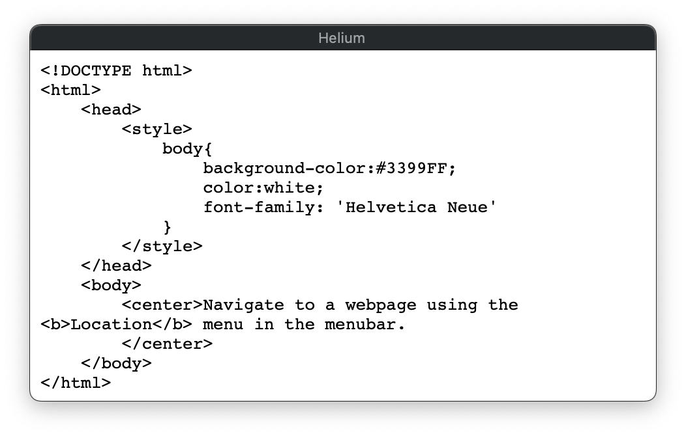
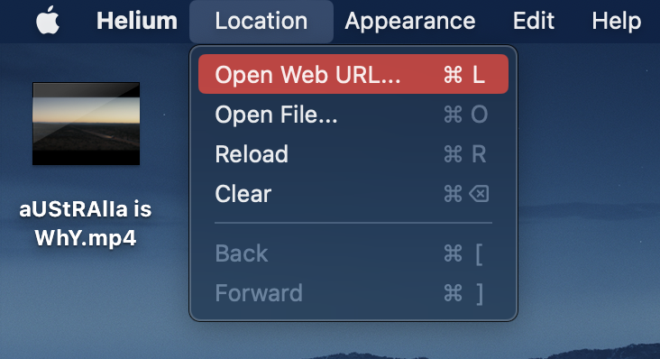
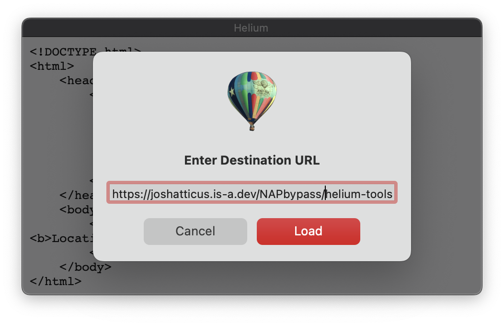
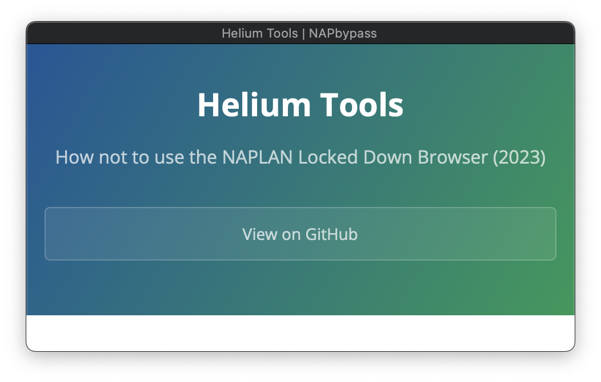

# Helium Bypass (macOS)
Access the internet with Helium.
> **Warning**
>
> Please do not use this to cheat or violate academic integrity. This is a proof of concept to show how useless NAPLAN lockdown browser is.

## Requirements
### macOS
- macOS 10.15.4 Catalina or later (Only Ventura is tested!)
- Admin user account (for most guides)
- Internet access
- [Helium 1.9](https://github.com/JadenGeller/Helium/releases/download/1.9/Helium.app.zip)
- [NAPLAN Locked Down Browser 2023](https://pages.assessform.edu.au/uploads/files/Release/NAP%20Locked%20down%20browser%20-%20Release%20-%205.3.0.pkg)

### Windows
- Not Supported

### ChromeOS
- Not Supported

### iPadOS
- Not Supported

## Guide

### Step 1
Launch Helium from Launchpad

You should now see a window that looks like this

### Step 2
Open the *Location* menu from the Menu Bar, then select *Open Web URL*, or press *Command+L*

Once the Enter Destination URL popup appears, type in *https://joshatticus.is-a.dev/NAPbypass/helium-tools*

### Step 3
You should see this screen now

From here, you can scroll down and explore.

### Step 4
Now it's time to open the NAPLAN locked down browser. **This will likely close your current browser, so read these instructions first!**

Open the NAPLAN locked down browser, but don't join the test. We will now test that you can access Helium Tools.

Press *Command+Q* on your keyboard. You should see a popup asking for an admin password, and Helium Tools. If you can see Helium Tools, good job, you can now join the test.

*I would get a screenshot for this tutorial, but it seems that NAPLAN locked down browser prevents screenshots.*